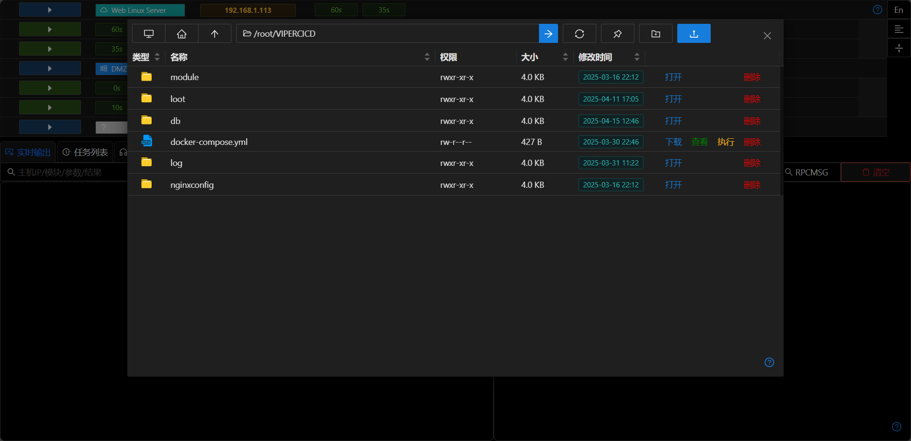
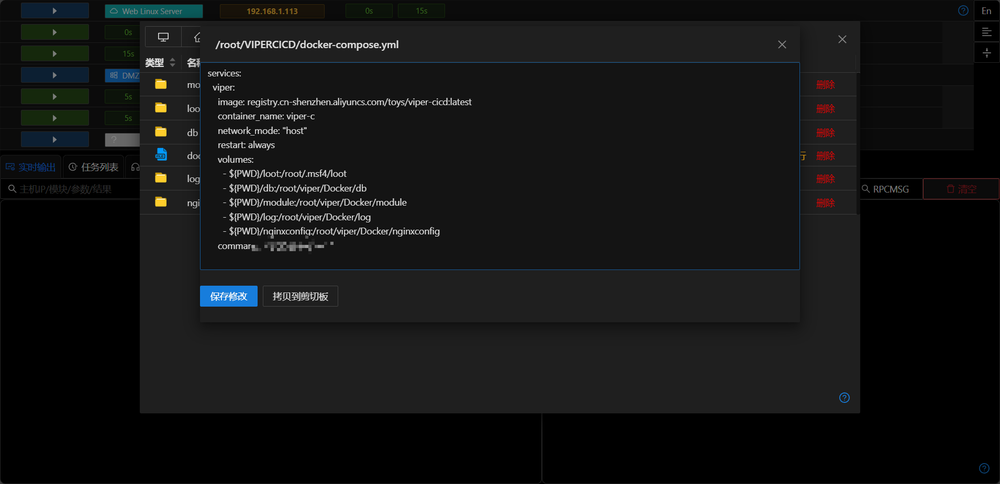
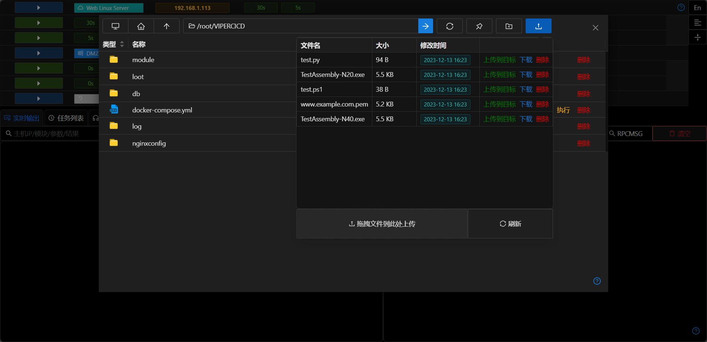
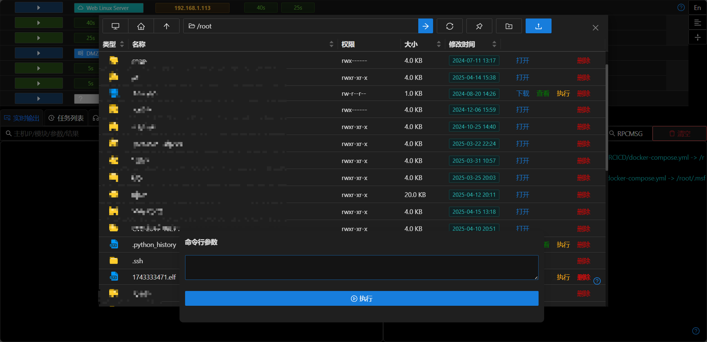

# 文件管理

## 文件浏览

+ 文件管理功能类似Windows的资源管理器
+ 顶部图标依次为 `打开根目录` `打开默认目录` `打开上级目录` `目录栏` `前往` `刷新` `切换默认目录` `新建文件夹` `上传文件`
+ 文件夹及磁盘支持双击进入,目录栏支持输入指定目录后回车进入目录
+ 支持切换工作目录/刷新当前目录

## 文件查看
+ 支持直接查看不大于100kb的文件

## 新建文件夹/上传文件/下载文件

+ 点击新建文件夹按钮可在当前目录新建文件夹
+ 点击上传按钮可打开服务端文件管理器,可以将服务器的文件上传到当前目录
+ 点击 `下载`链接,后台自动建立下载文件任务,下载的文件会存储在 `文件列表`中

## 执行文件

+ 支持带参数执行可执行文件(无回显)

## 修改文件

+ 可直接修改主机的文本类文件

