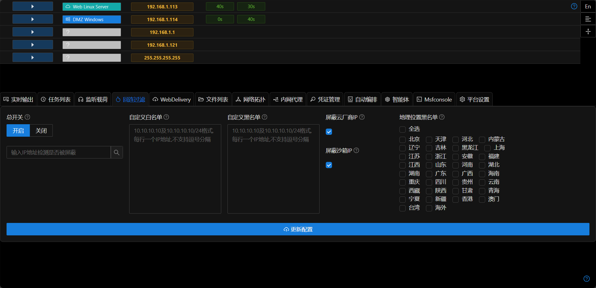
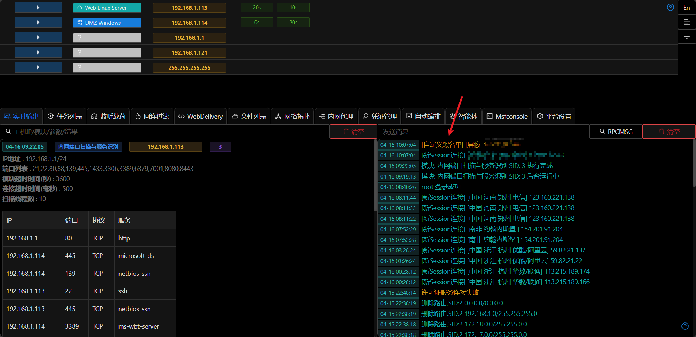
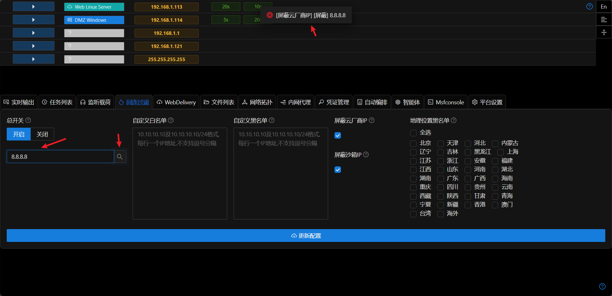

# 回连过滤

每当客户端连接viper的监听时,viper会根据客户端的网络IP地址来判断该IP是否允许连接.允许时则正常传输载荷到客户端,不允许时直接断开网络连接.

## 使用场景

+ 当使用鱼叉钓鱼时,目标的地理位置为一个固定区域(例如一个省),监听防火墙可以屏蔽其他国外或其他省的IP连接监听.
+ 红队模拟时,如果可以根据需要屏蔽沙箱及网络测绘服务器连接监听.
+ 如果IP地址被不被允许连接监听,则客户端(通常为沙箱或者蓝队人员)无法获取stager,就无法判断C2服务器类型.

## 使用方式

1. 打开总开关,填写对应配置
2. 配置的对应说明,点击?即可查看
3. IP地址过滤检查是从左到右,从上到下

> + 防火墙总开关 关闭 -> 放行
> + 防火墙总开关 打开 -> 下一步检查
> + 自定义白名单 命中 -> 放行
> + 自定义白名单 未命中 -> 下一步检查
> + 自定义黑名单 命中 -> 屏蔽
> + 自定义黑名单 未命中 -> 下一步检查
> + 屏蔽云厂商 命中 -> 屏蔽
> + 屏蔽云厂商 未命中 -> 下一步检查
> + 屏蔽沙箱IP 命中 -> 屏蔽
> + 屏蔽沙箱IP 未命中 -> 下一步检查
> + 地理位置黑名单 命中 -> 屏蔽
> + 地理位置黑名单 未命中 -> 放行

4. 如果需要确认某个IP是否被过滤,可以使用左侧搜索功能确认.

5. 执行效果
当不在允许列表中的IP连接viper的监听时,会收到屏蔽提示