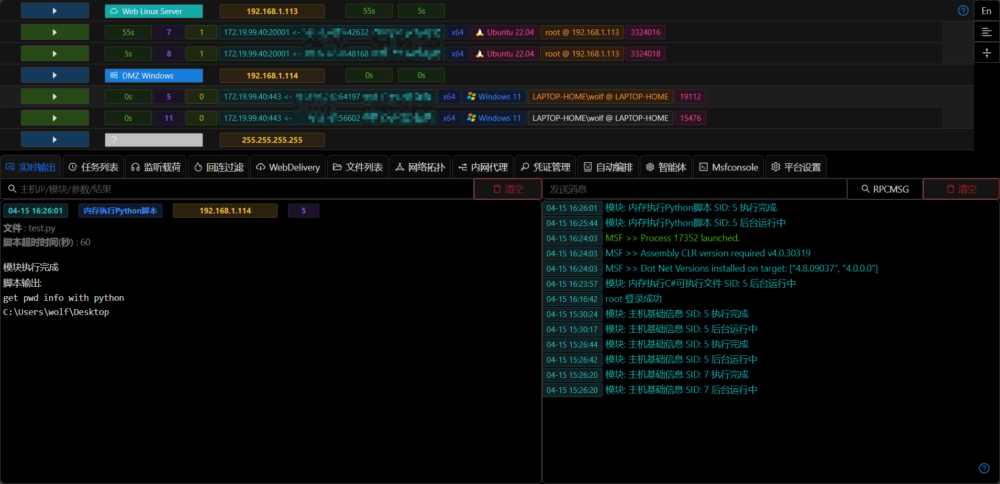
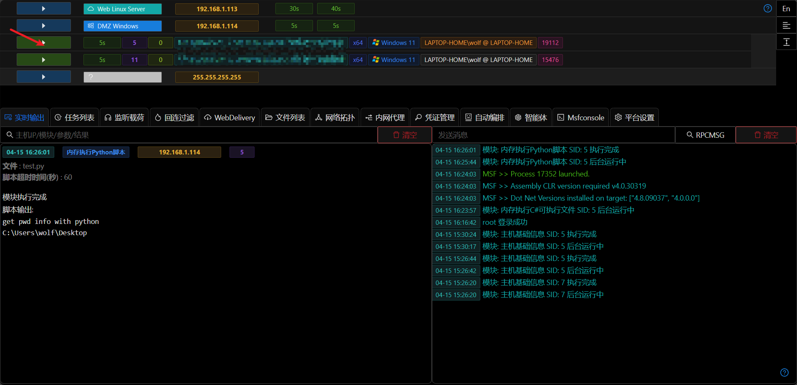
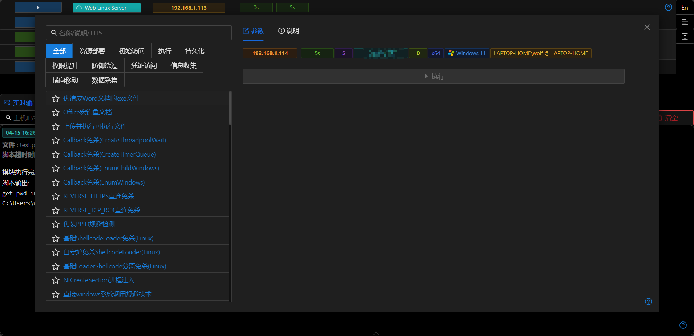

# 主机&权限

## 运行模块

+ 点击后显示模块列表

## 主机操作入口

+ 点击主机IP会弹出主机操作的选择框

## 主机标签/备注

+ 点击主机的标签会打开主机标签备注修改功能

## 权限操作入口

+ 点击主机条目,会展开/缩放主机下所有的Session，点击Session条目会展示权限操作功能列表

## 权限信息提示

将鼠标停留在权限的相关信息上方,会提示更加详细的信息

+ Session相关Handler信息
+ 操作系统全版本号
+ Session 进程Pid

## 右侧快捷功能

### 只显示Session开关

当前开关打开时,界面上只会显示存在255.255.255.255和存在Session的主机,开关关闭时正常显示所有主机