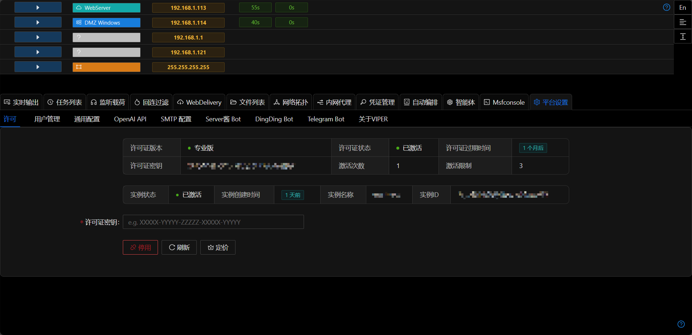

# License

## 社区版 vs 专业版

安装后默认为社区版,购买订阅后可升级为专业版.版本功能对比或专业版购买可参考 [定价](../pricing.md).

## 激活设备

购买订阅后系统会发送License代码到邮箱,登录Viper后在`平台设置` `许可管理` 中输入License代码即可激活Pro版本订阅.

每个License可同时激活3台设备,去激活设备后不计入3台设备限制.

## 去激活设备

在`平台设置` `许可` 中点击`去激活`按钮即可取消激活.

## License过期

License过期后平台会进行提示,专业版在过期7天内仍可用,请查看订阅邮箱更新最新的License.

## 查看订阅信息 / 订阅后邮箱未收到License

- 访问 [https://www.creem.io/my-orders/login](https://www.creem.io/my-orders/login)
- 输入订阅时填写的邮箱,邮箱会收到一次性登录链接
- 点击链接后即可查看当前邮箱的订阅信息及License

