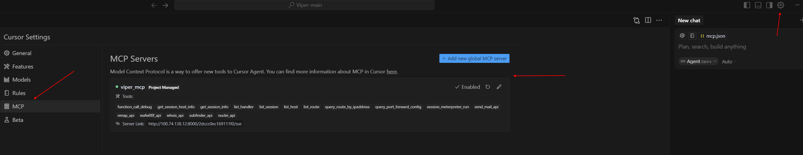
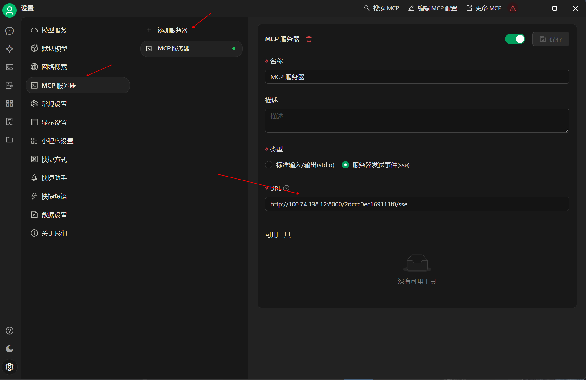
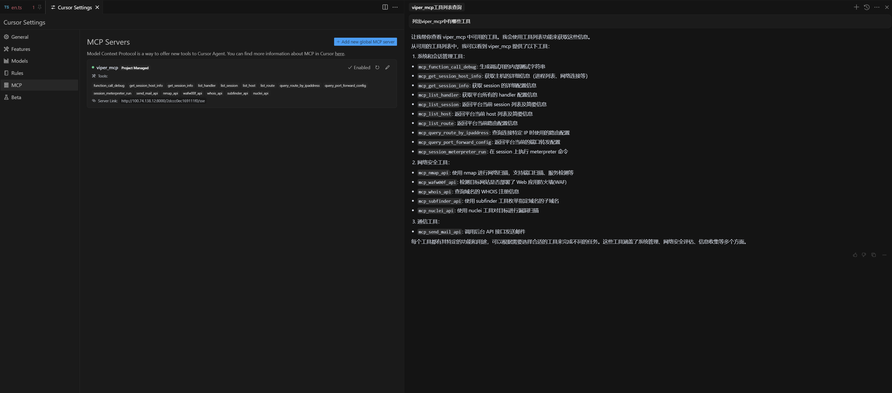
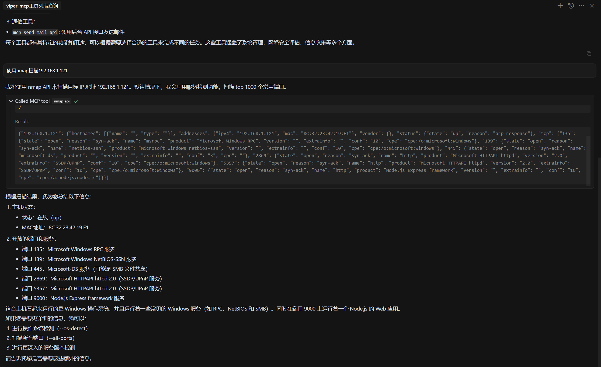
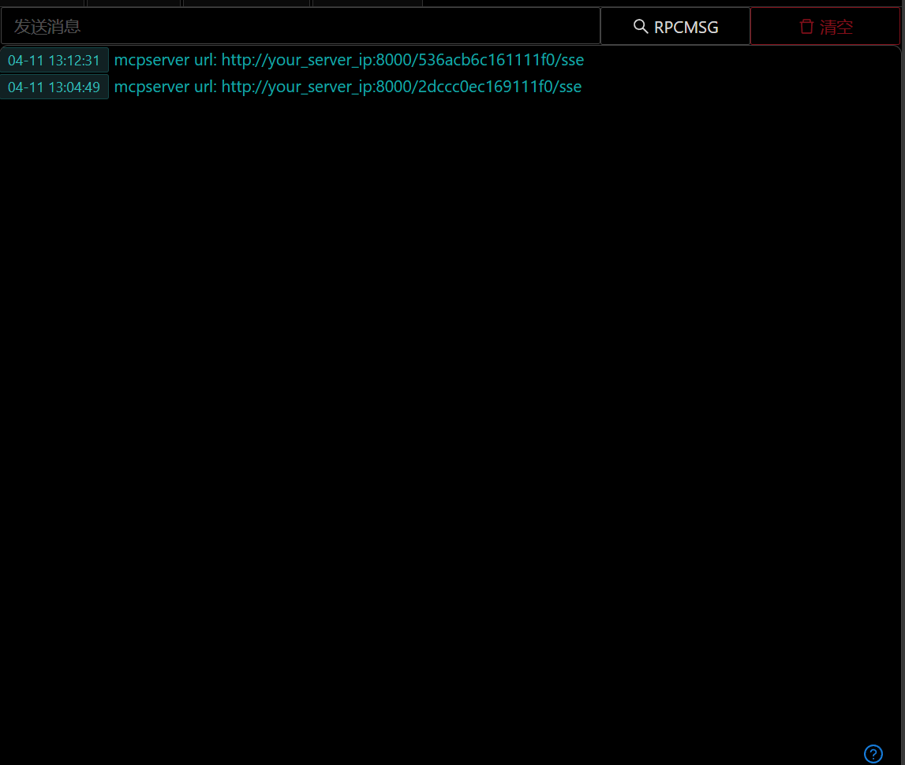

# MCP服务器

## 支持工具列表

#### Viper平台管理工具

- `mcp_function_call_debug`: 生成调试用的内部测试字符串
- `mcp_get_session_host_info`: 获取主机的详细信息（进程列表、网络连接等）
- `mcp_get_session_info`: 获取 session 的详细配置信息
- `mcp_list_handler`: 获取平台所有的 handler 配置信息
- `mcp_list_session`: 返回平台当前 session 列表及简要信息
- `mcp_list_host`: 返回平台当前 host 列表及简要信息
- `mcp_list_route`: 返回平台当前路由配置信息
- `mcp_query_route_by_ipaddress`: 查询连接特定 IP 时使用的路由配置
- `mcp_query_port_forward_config`: 返回平台当前的端口转发配置
- `mcp_session_meterpreter_run`: 在 session 上执行 meterpreter 命令

#### 网络安全工具：

- `mcp_nmap_api`: 使用 nmap 进行网络扫描，支持端口扫描、服务检测等
- `mcp_wafw00f_api`: 检测目标网站是否部署了 Web 应用防火墙(WAF)
- `mcp_whois_api`: 查询域名的 WHOIS 注册信息
- `mcp_subfinder_api`: 使用 subfinder 工具枚举指定域名的子域名
- `mcp_nuclei_api`: 使用 nuclei 工具对目标进行漏洞扫描

#### 通信工具：

- `mcp_send_mail_api`: 调用后台 API 接口发送邮件

## 启动MCP服务器

- Viper处于正常运行状态
- 进入Docker容器命令行

```shell
cd /root/VIPER
docker exec -it viper-c bash
```

- 启动MCP服务器

```shell
python3.12 /root/viper/Worker/mcpserver.py
```

命令会输出mcp服务器url

```shell
mcp server url: http://your_server_ip:8000/XXXXXXXXXXXXX/sse
```

## 配置MCP服务器

### Cursor

- <project_root>/.cursor/mcp.json中配置mcp服务器url

```json
{
  "mcpServers": {
    "viper_mcp": {
      "url": "http://your_server_ip:8000/XXXXXXXXXXXXX/sse"
    }
  }
}
```

- 配置完成后效果



### Cherry Studio



## 使用MCP服务器

### Cursor




## MCP服务器后台运行
可以使用如下命令后台运行mcp服务器
```shell
nohup python3.12 /root/viper/Worker/mcpserver.py &
```
生成的url可以通过做Viper UI中的通知查看
