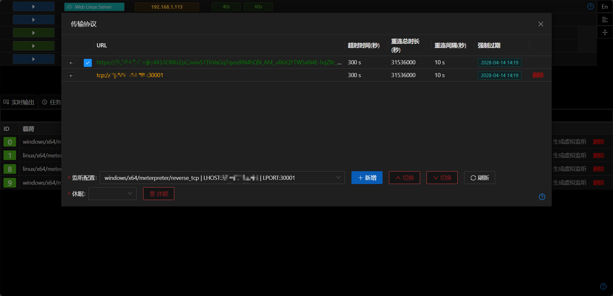

# 传输协议

## 添加/删除

+ 传输协议是指Session如何通过网络连接与Viper服务器通讯
+ 选择底部监听后可以快速将监听所对应的传输协议添加到Session中
+ 可以直接删除非当前正在使用的协议

> 通常Session在初始阶段只能指定一种传输方式,在session完全加载后,可以增加多个传输协议,保证传输可靠性

## 切换

+ 如果Session拥有多个协议,可以手动进行切换操作
+ 切换传输协议,Viper会关闭当前Session,并等待Session所在进程使用新的传输协议连接

## 休眠
+ 选择`休眠`后,Session会关闭现有连接,在指定时间后从新建立连接

## 注意事项

+ 传输协议中无法添加rc4密码参数,所以不要将rc4类的监听添加到传输协议中.

