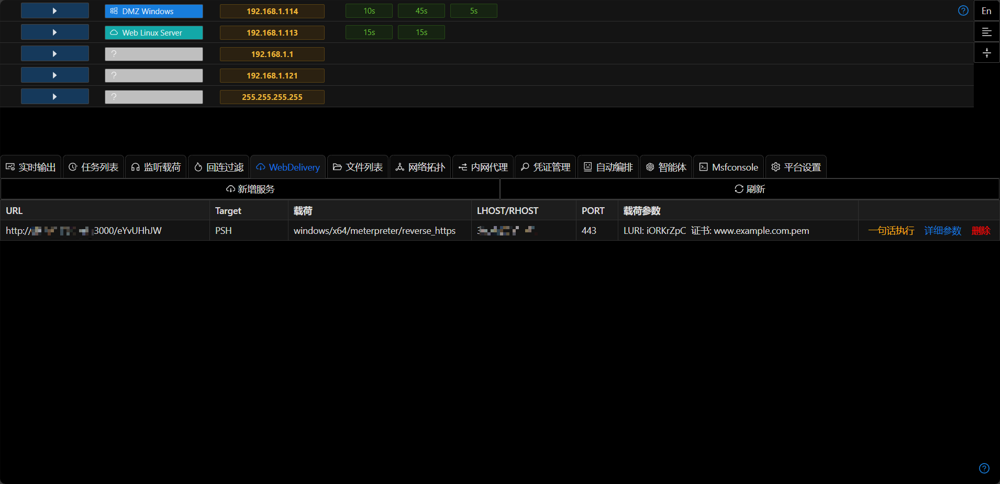
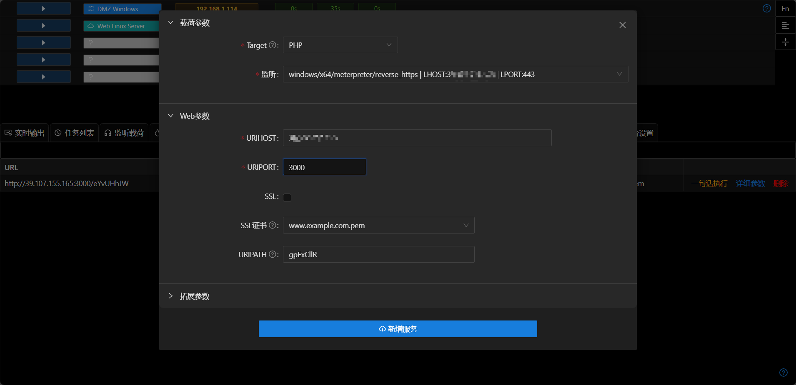

# WebDelivery

WebDelivery用于一句话加载payload.常用于可以执行命令,但是不方便上传文件的场景.

## 使用方法

+ 新建一个[监听](./handler_and_payload.md)

+ 选择`新增服务`,选择对应的监听

+ Target需要和Payload保持OS一致,如PSH只适用于Windows类型载荷

+ srvport需要为未被占用的端口,srvhost通常为vps的外网ip

+ 点击`一句话执行`获取需要执行的命令

+ 复制命令到对应主机执行,即可上线