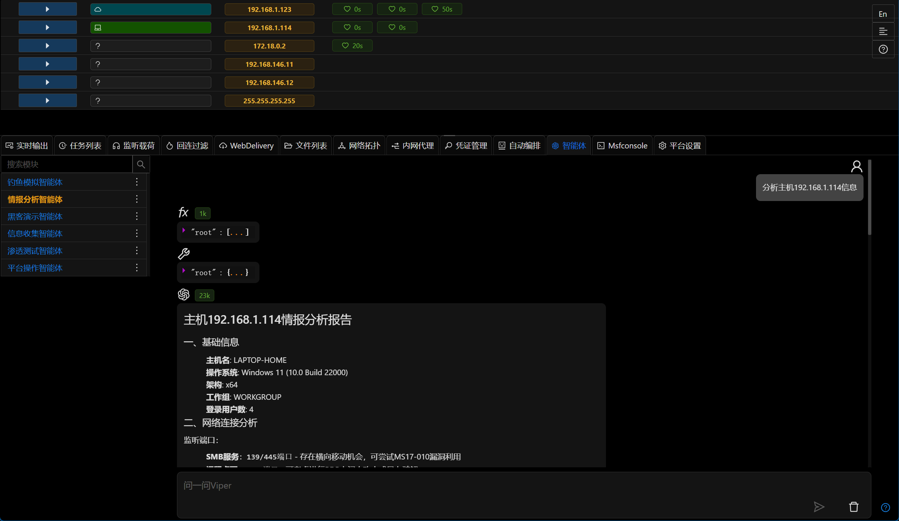
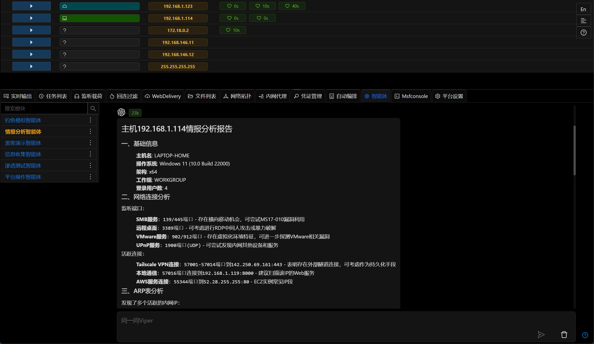

# 情报分析智能体

## 主要功能

智能体可以根据用户需求从系统中查询已有的信息,进行分析并给出下一步行动计划.

## 设计思路

- Viper当前以主机ip作为Key,汇总存储当前主机的情报(如网络连接,进程列表,操作系统等等)

> 选择Session->`运行信息`->`重新请求` 会将网络连接和进程等信息更新到数据库中
>
> 选择IP->`主机信息` 可以查看当前IP已经获取到的信息
>
> 一个主机可以存在多个Session,所以使用主机的IP作为Key

- 智能体会根据系统提示词对当前信息进行开放性的分析,帮助用户识别关键信息.

## 操作方法

