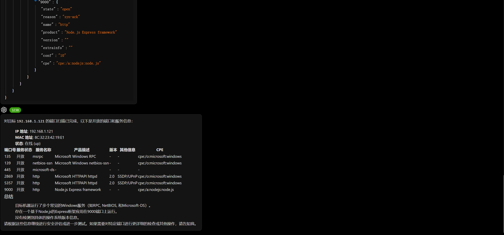
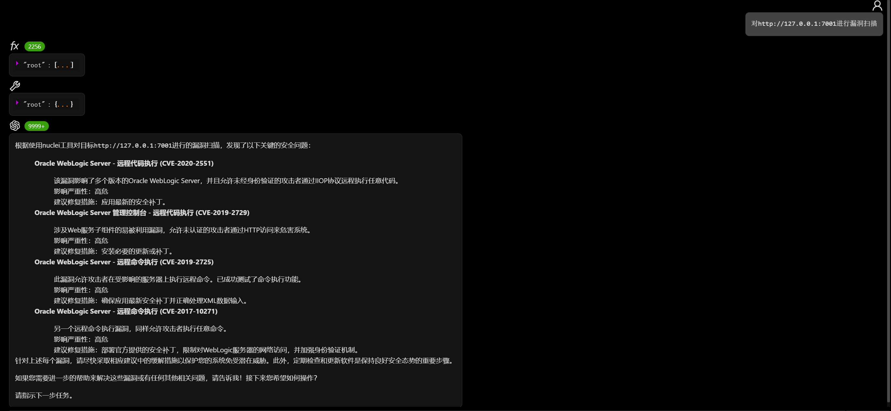
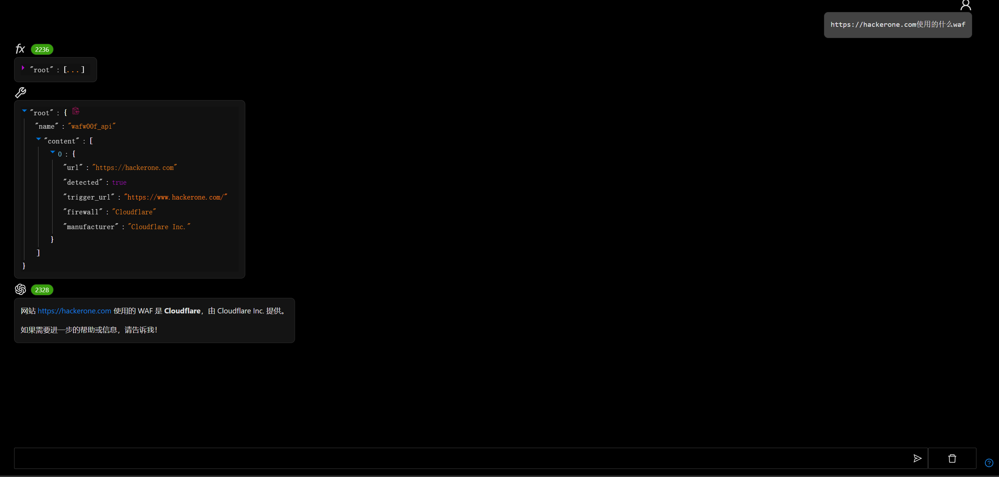

# 渗透测试智能体

# 主要功能

使用自然语言调用各种渗透测试工具,当前支持的工具列表

- nmap
- wafw00f
- subfinder
- nuclei
- ipgeo
- whois

渗透测试智能体是受到[pentestgpt.ai](https://pentestgpt.ai/)的启发而产生的

| 功能特性   | pentestgpt.ai | viper pentest agent |
|--------|---------------|---------------------|
| 运行环境   | 云端沙箱          | 本地环境 ✅              |
| 工具运行时长 | 限制5分钟         | 无限制 ✅               |
| 使用次数   | 免费版每天2次       | 免费版无限制 ✅            |
| 可用工具   | 免费版仅限指定工具     | 免费版可用所有工具 ✅         |
| 模型选择   | 仅GPT-4o       | 支持任意模型 ✅            |

# 操作方法

- 工具列表

- nmap

- subfinder

- nuclei

