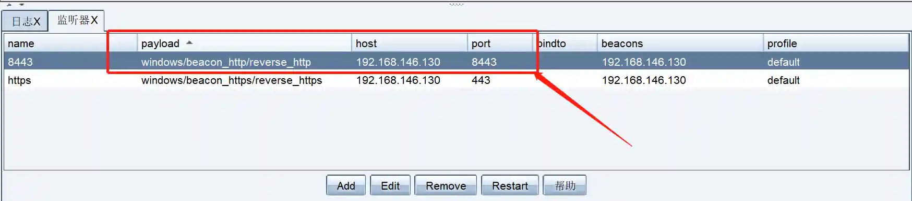
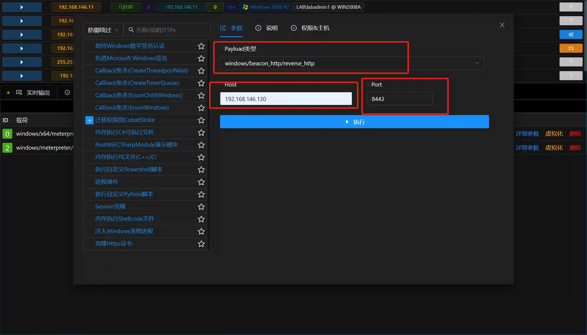

# 迁移权限到CobaltStrike

# 主要功能
用于将Session权限迁移到CobaltStrike的beacon

# 操作方法
+ 首先确保Viper中有Windows类型的Session(x64与X86都可以)

+ 在CobaltStrike中建立Listener,其中payload,host,port三个字段后续会用到

+ 打开模块,根据CobaltStrike中Listener字段信息填写模块参数

+ 运行模块后CobaltStrike中就有Beacon上线了.

