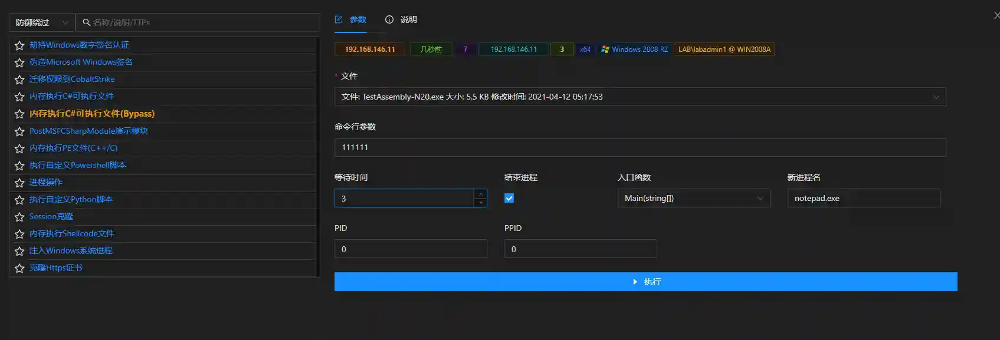

# 内存执行C#可执行文件(Bypass)

# 主要功能
模块将C#编写的exe文件加载到内存中,然后使用CLR执行.

 需要已控主机安装.net2.0（win2008默认安装）或.net4.0（win2012默认安装）. 

可执行文件需要与已控主机.net版本相同. 

功能类似CS的execute-assembly,当C#需要输入参数时需要确保填写参数. 

本模块新增了BypassETW及BypassAmsi功能,但模块只适用于x64位系统

# 操作方法

