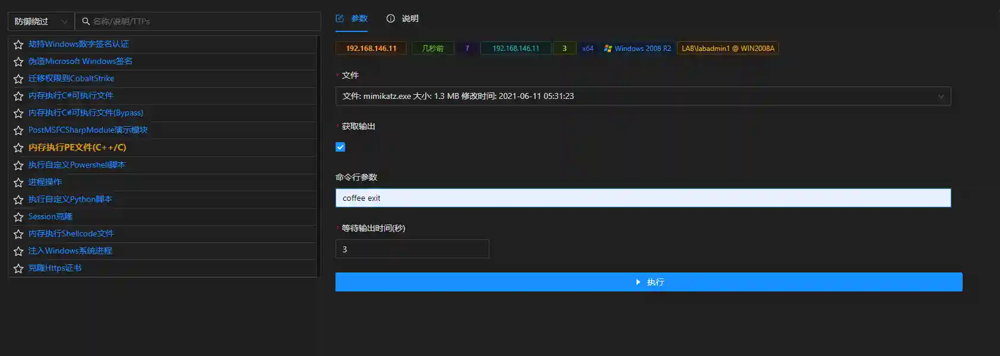

# 内存执行PE文件(C++/C)

# 主要功能
在主机内存中注入PE文件并执行,文件后缀必须为exe. 

模块只支持由C++及C编写的PE文件,如mimikatz,putty. 

不支持由golang编写的exe文件,如nps,frp.如不需要获取输出(如session上线),无需勾选获取输出. 

如需要获取PE执行之后的输出(如mimikatz),请勾选获取输出选项,并填写等待时间

# 操作方法

