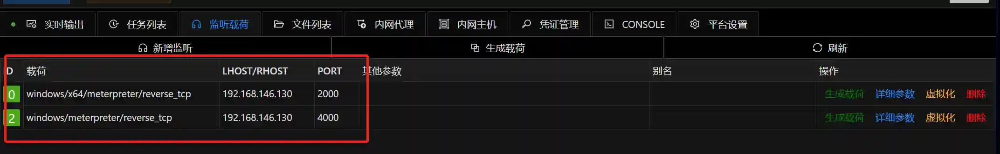
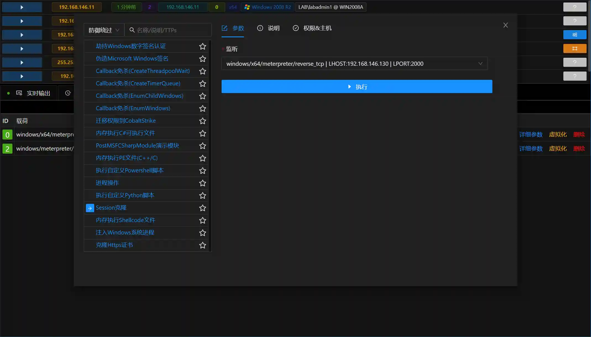
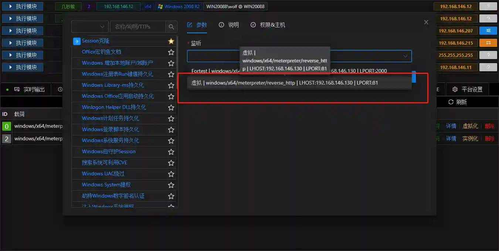

# Session克隆

# 主要功能
复制Session,确保一个Session掉线后权限不丢失,或者用于迁移权限到CobaltStrike

# 操作方法
## Session克隆
+ 存在Windows类型的Session(x64与X86都可以)

+ 存在对应的真实监听

+ 打开模块,选择对应的监听

+ 执行模块,面板就会出现新克隆的Sesison

## Cobalt Strike 上线
+ VIPER 可以通过虚拟监听+Session 克隆的方式方便 Cobalt Strike 上线.
+ 首先在 Cobalt Strike 建立监听

+ 在 VIPER 中建立对应的**虚拟监听**

> 虚拟监听表示只是新增监听配置信息,并没有实际建立监听
>
> 注意LURI需要为空
>

+ 选择对应的 Session,然后运行 **Session 克隆**模块

+ 运行后 Cobalt Strike 即上线

