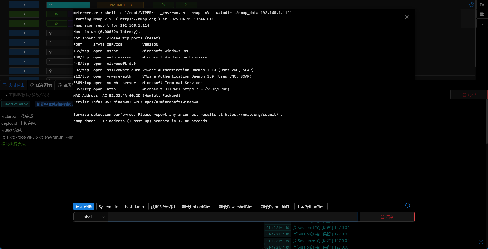

# 部署Kit套件到Linux主机

## 主要功能

Kit套件当前包含以下工具:

- nmap (包含指纹识别/OS识别)
- python3.12 (包含impacket)
- socat

## 操作方法

- 模块执行成功后,即可在目标主机中执行kit套件中的工具
- Kit套件部署后,会自动将Python Interpreter添加到主机信息中,可以在主机信息中查看,运行相关模块时会自动使用该Python Interpreter

- nmap

- python3.12

- socat

