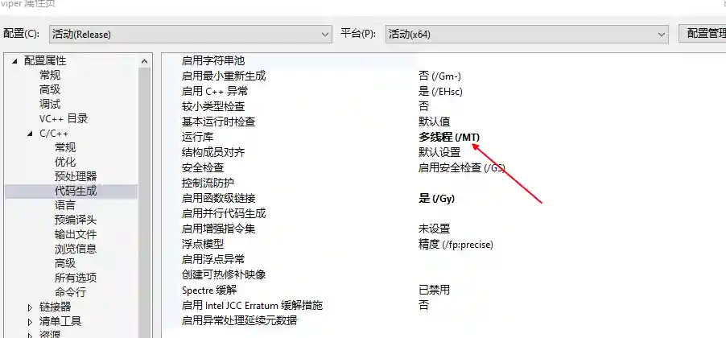

# 伪造成Word文档的exe文件

# 主要功能
生成带有Word图标的exe文件,exe运行后自动释放内置的word文档,自拷贝到%User%\Documents目录并启动,然后删除自身

# 操作方法
+ 新建监听
+ 运行模块

+ 下载生成的VS工程

+ 修改工程中word文档的内容(不要修改文件名!!!!!)

+ VS打开工程,编译

+ 修改编译完成的exe为一个钓鱼文件名称

> 比如 安全开发手册.docx.exe
>

+ 通过鱼叉邮件发送到对方

# 运行效果
+ 双击exe后会在本地释放一个docx文件并打开,然后删除自身(exe文件)

+ 程序会将自身拷贝到%USER%\Documents目录并执行

