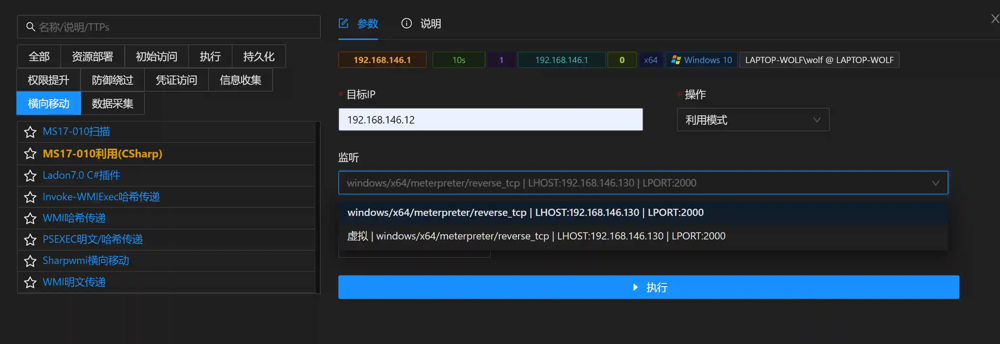
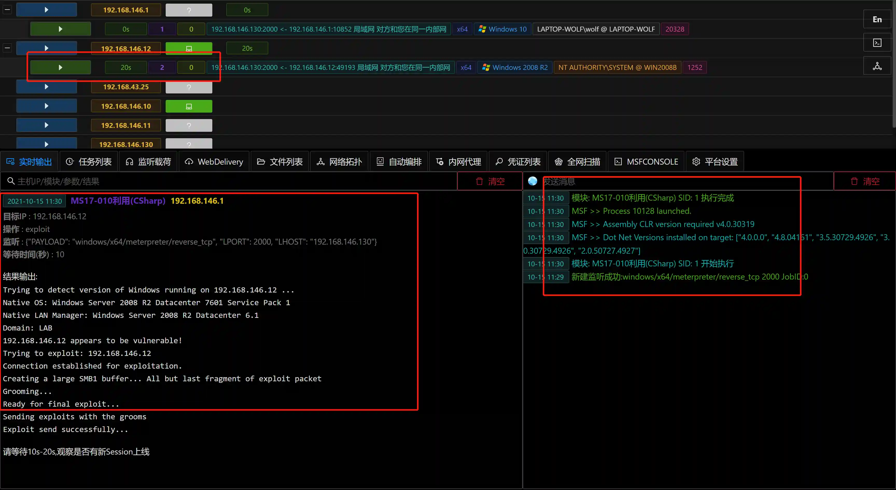

# MS17-010利用(CSharp)

# 主要功能
模块内存执行定制版的Eternalblue.exe.

模块支持Detect和Exploit两种模式,支持利用Win7及Win2008的MS17-010利用.

与MSF官方MS17010利用程序相比,该模块在进行漏洞利用时所有网络流量在内网发送,无需从服务器经过Session路由转发到内网,成功率更高.

# 操作方法
+ 填写参数

+ 执行结果

