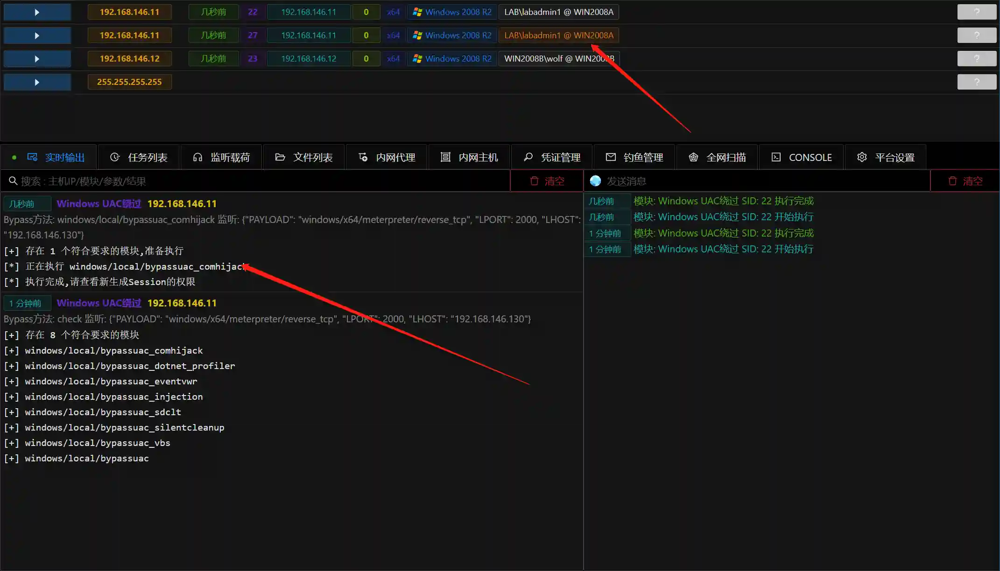

# Windows UAC绕过

# 主要功能
内置多种种方式绕过系统UAC获取管理员权限.

+ 自动模式:自动选择绕过技术并执行
+ 手动模式:手动选择某种绕过技术并执行
+ 检测模式:自动检测Sesion适用哪些绕过技术(不执行)

# 注意事项
+ 模块需要Session完整性权限为中以上并处于管理员组.
+ 自动模式会运行多个子模块尝试BypassUAC,杀软会拦截.
+ 建议使用检测模式获取适用的子模块列表后,单独手工依次运行.

# 操作方法
+ 获取Session
+ 查看Session信息,确认**Session完整性权限为中以上**** ,****处于管理员组,UAC等级为默认**

+ 运行检测模式,查看那些模块可用

+ 根据检测结果,单独运行子模块,或者使用自动模式

