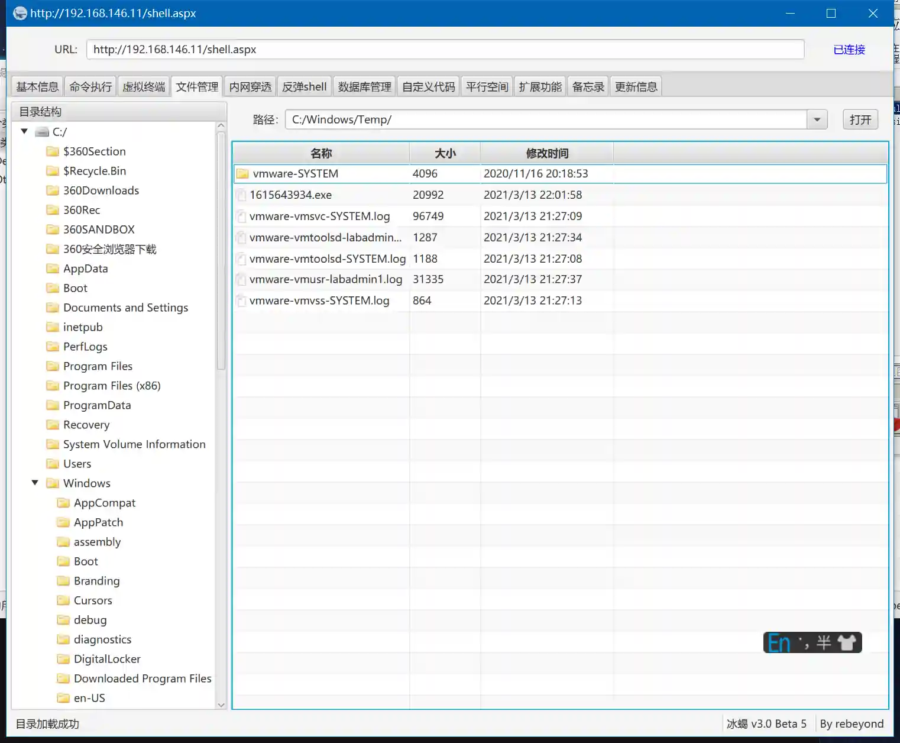

# SweetPotato提权

# 主要功能
模块使用SweetPotato.exe进行提权.

SweetPotato要求有本地服务权限,如IIS的Network Service

# 注意事项
部分IIS服务器是使用ApplicationPoolIdentity用户启动的,该用户为虚拟用户,无法提权.

具体现象是使用webshell可以执行命令,但是无法执行外部exe.

# 操作方法
+ 以IIS提权为例说明
+ 新增监听,生成载荷
+ 使用webshell将载荷上传到目标并执行

+ 此时获取到一个Network Service权限的Session

+ 使用生成的Session运行模块,参数依然填写运行之前上传的载荷

+ 运行模块,获取到SYSTEM权限Session

