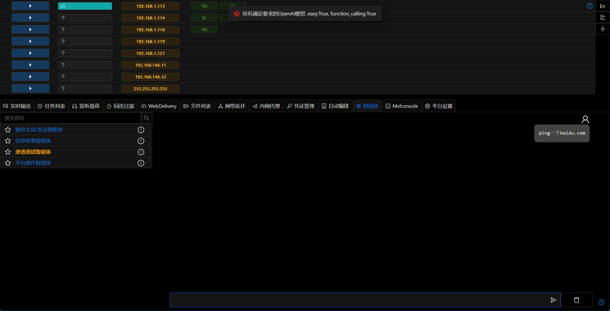

# 3.1.1 - 混乱是阶梯

## 介绍

在过去的这些年中,我们一直致力于为红队提供一个强大而灵活的工具集.作为一个社区驱动的项目,我们更多的专注于功能的扩展和改进,而非广泛的宣传.
对手模拟及红队行动平台这个领域已经有众多玩家(Cobalt Strike/NightHawk/BruteRatel),但我们想证明VIPER是一个更好的选择,所以我们决定加入这个平台混战的游戏中,毕竟,混乱是阶梯.

## 所有东西都是新的!

新的官网! Viper当前官网为[VIPERRTP](https://www.viperrtp.com),官网中包含Viper的介绍,使用手册,模块文档,博客等.新版本的平台的文档链接也已经关联到新的官网.
新的图标! 更加酷炫!
新的仓库! Viper当前支持在dockerhub中下载最新的镜像,方便用户快速部署.

## AI智能体

当前可以添加多个符合openai标准的key,并支持根据模型的标签不同来使其执行不同的任务.当前氛围easy,reasoning,function calling三种标签.

- easy: 简单任务,如邮件生成,基础的数据分析等
- reasoning: 推理任务,根据需求创建计划,任务分解,综合数据等
- function calling: 函数调用任务,如获取系统信息,执行命令,获取文件内容等

智能体加入了内网路由,端口信息等功能.

## 优化Bug修复

- 平台默认会筛选支持多级控制的Payload,增强稳定性
- 更新部分i18n及文档链接