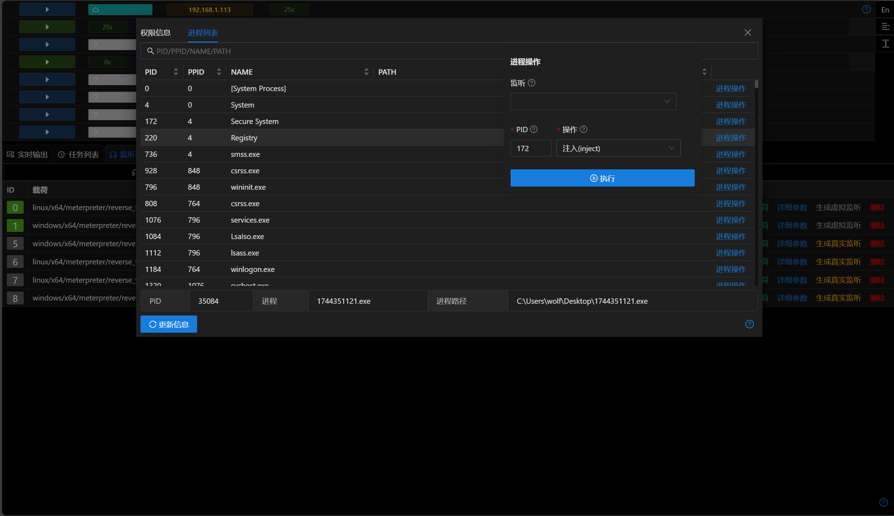
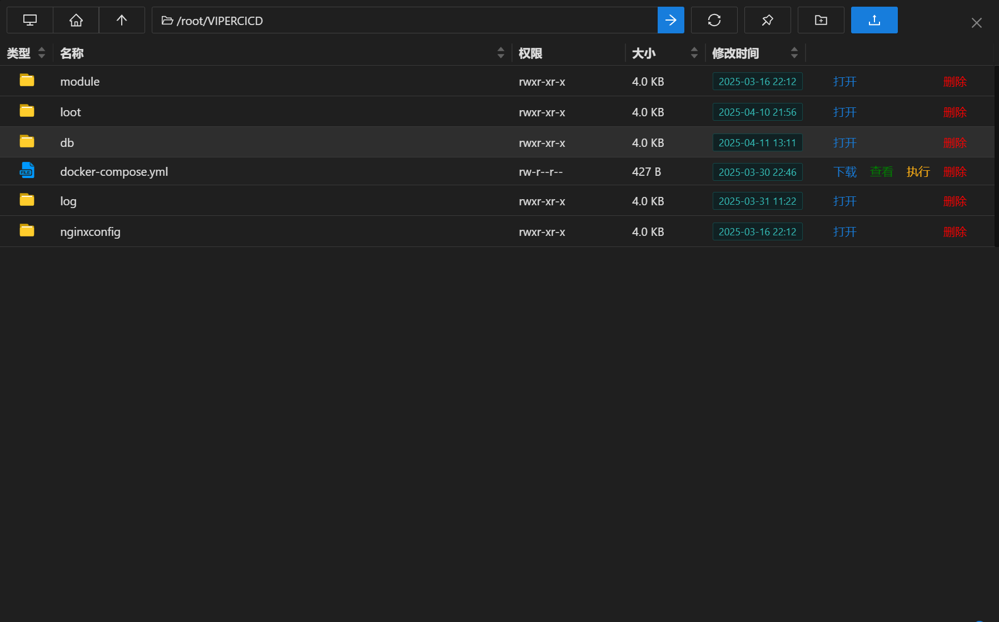
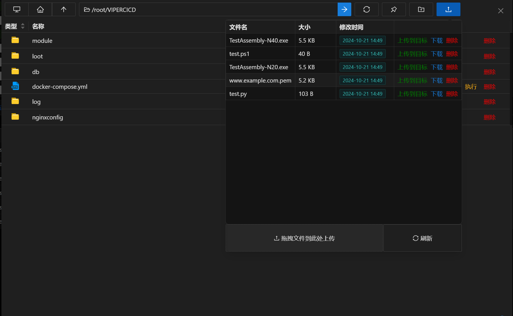
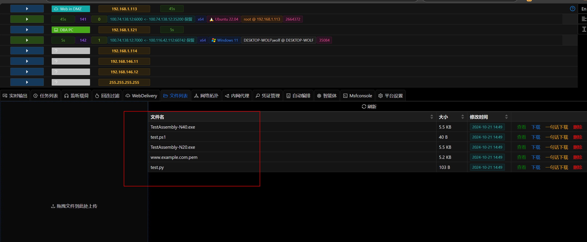
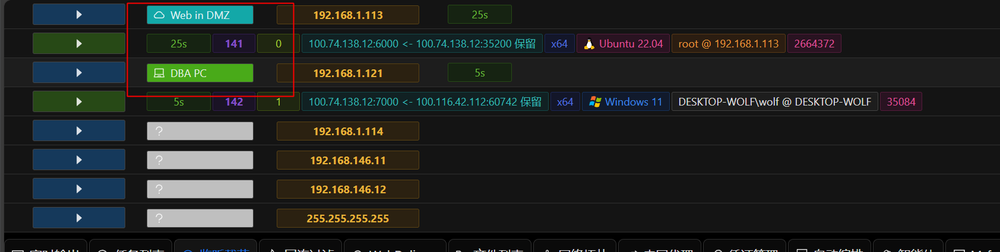
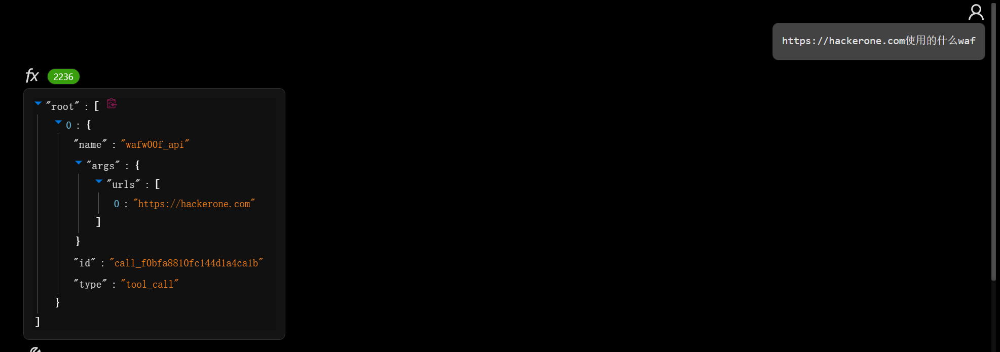

# 3.1.2 - 渗透测试智能体和MCP服务器

## 介绍

作为业界首个集成LLM智能体的红队平台,新版本中加入了渗透测试智能体和MCP服务器两项LLM Agent相关功能.

后续更新中会更多的将LLM和Agent能力添加到Viper中.

> 为什么Agent还不能帮我把这些文档都写好 ! ! !

## 渗透测试智能体

因为当前LLM和工程上的限制,一个全自动的Agent效果并不理想.

如果Agent能帮助渗透测试工程师输入繁琐的工具参数,分析工具的结果,给出下一步渗透计划,这个目标是完全可以实现的.

[渗透测试智能体文档](./../module/AI_Agent_Session_LangGraph_Pentest.md)

## MCP服务器

如果说当前生成式AI领域什么最火,那非MCP莫属.

Viper新版本中加入了可独立运行的MCP服务器,MCP服务器的使用文档及支持的工具列表参考说明文档.

[MCP服务器文档](./../guide/mcpserver.md)

## Bug修复

- 修复无法调用Session文件上传下载/进程操作的问题

- 默认证书及测试用python/powershell脚本已可用

- 修复运行智能体模块返回异常问题 [issus](https://github.com/FunnyWolf/Viper/issues/238)

## 优化

- Host的标签和备注当前已经集成到一起

- 智能体的工具调用和工具结果使用JSON格式展示

- Nuclei 默认配置UI

- `生成PE/ELF`修改为原生exe及elf payload,源码编译版本可通过模块生成
- linux删除文件夹时会检查是否为空文件夹

- 优化了部分UI界面,清理废弃的前端组件.