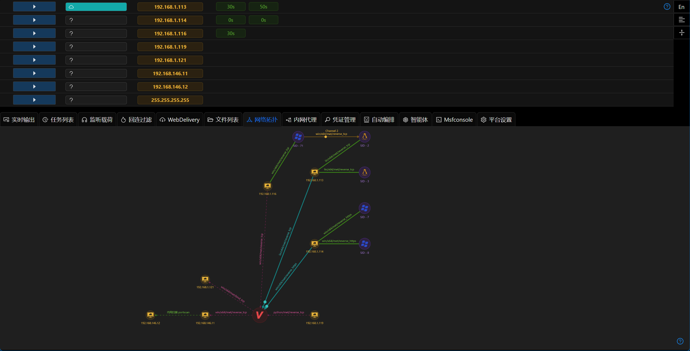

# 3.1.3 - 这不是Bug,这是特性

## Telegram Bot

十分钟零成本创建Telegram Bot机器人

## 部署Kit套件到目标主机

一键植入Nmap+Python3打造内网侦察-渗透双通道

## 优化

- 大量的UI/UX优化 (22 git commit)

> 优化页面真上瘾,CSS真反程序员

- 大量的文档更新 (`指南`页面的所有文档)

> 我讨厌两种人,写工具不写文档的人,让我给工具写文档的人

- 更新`自动安装`脚本,安装时可直接生成随机SSL证书,自定义端口,添加Basic认证等反溯源配置

> 妈妈再也不担心我被封IP了

- Session支持`传输协议`功能时才展示选项
- 添加Open AI配置时,如果选中function calling选项,后台会检查是否支持function calling
- `渗透测试智能体`和`MCP服务器`当前支持调用本地terminal

> 现在可能没啥用,但后续集成更多红队命令行工具就有用了,在做了,在做了 (进度 0%)

- 智能体运行过程中如未发现符合要求的大模型配置,会在界面发送错误提示

- Session的Console新增Meterpreter/Shell切换功能

- 用户发送消息时会使用不同的颜色

- 更新`网络拓扑`展示组件,更好的区分网络通讯与Session绑定逻辑

- 优化`端口转发`提示信息

## Bug修复

- 修复`端口转发`反向转发时不必要的端口占用检查
- 修复`任务列表`运行中的任务Readme链接不显示问题
