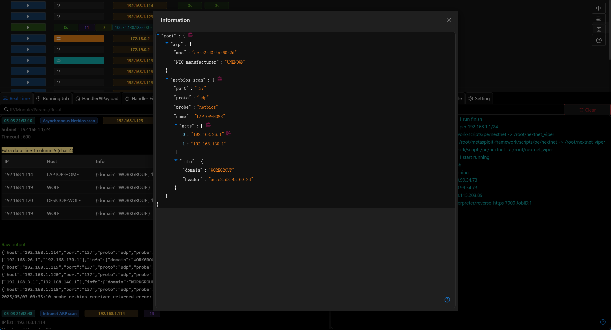

# 3.1.4 - 劳动节快乐

## 渗透测试智能体

- 智能体已支持MSF相关功能的调用
- 智能体当前可通过调用多个内置工具进行自动化渗透测试

<iframe src="//player.bilibili.com/player.html?isOutside=true&aid=114444319334312&bvid=BV1xdGRz2E2R&cid=29772089454&p=1" scrolling="no" border="0" frameborder="no" framespacing="0" allowfullscreen="true"></iframe>

> 当前智能体的自动化能力处于概念验证阶段

## AI 智能体

- 新增中断运行功能,用户可在界面手动中断智能体运行

> 新版智能体在自动化渗透测试时会进行多轮自动化工具调用,所以中断运行功能必不可少

- 优化UI交互及性能

## MCP服务支持MSF相关功能

- MSF的相关功能也加入到了MCP服务器中

## 文档优化

官网中所有的文档文字说明都已更新,模块/教程部分的图片在新版本更新完成.

平台模块的标题及说明已全部更新.

> 解决了文档的历史包袱,终于可以愉快地写代码了.

## 优化

- 大量的UI/UX优化
- 更新`搜索可利用CVE`内置的CVE数据库
- 内网扫描类模块当前会将对应主机的信息存储到`主机信息`中

- 更新metasploit-framework至最新版本(6.4.61)
- 优化自动化安装脚本,用户误输入不会导致安装中断

## Bug修复

- 修复免杀模块低概率生成的源码无法编译问题
- 修复MSF模块快速结束时后台无法回调问题
- 修复`WMI哈希传递`拒绝运行问题
- 修复`获取Windows浏览器密码(C#)`超时问题
- 修复模块中无法正确处理CIDR的问题
- 修复`Office宏钓鱼文档`x64类型payload无法使用问题
- 修复多个持久化相关模块无法使用x64类型payload问题

