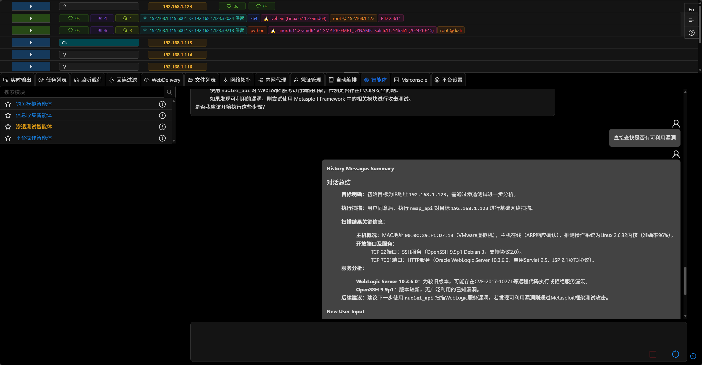

# 3.1.5 - GitHub Issues 之周

渗透测试智能体优化了提示词并新增总结功能,添加Bark消息推送功能,重构部分免杀模块,License功能调整避免因网络或未更新License导致影响使用,以及大量UI/UX优化

## 渗透测试智能体

- 多轮对话时(超过10个messages),会自动进行总结,减少Token使用

- 更新智能体提示词
- 智能体当前会根据前端界面语言来切换输出语言

## Bark 消息推送

- 新增Bark消息推送功能,用于接收平台的消息通知

[Bark Bot 文档](../guide/bark_bot.md)

## 免杀模块

- `载荷`生成的免杀的选项已独立成免杀模块
- [Linux基础Shellcode加载器](../module/Execution_UserExecution_LinuxBaseShellcodeLoader.md)
- [自定义Linux Shellcode加载器](../module/Execution_UserExecution_LinuxLoaderDIY.md)
- [自定义Windows Shellcode加载器](../module/Execution_UserExecution_LoaderDIY.md)
- [Windows基础Shellcode加载器](../module/Execution_UserExecution_ExeSrc.md)
- [MSBuild执行Shellcode](../module/Execution_UserExecution_MSBuild.md)

## License功能调整

- 优化因网络波动(或GFW)而导致无法连接License服务器时处理逻辑
- License过期后,会自动延长7天并进行提醒,方便用户添加新的License

## 优化

- UI/UX优化
- 支持鼠标拖动调整上下空间大小
- 新建监听自动添加`别名`
- osx类型session显示mac图标
- 支持osx类型payload
- `文件列表`支持直接编辑文本文件
- 添加[GodPotato提权](../module/PrivilegeEscalation_ExploitationForPrivilegeEscalation_GodPotato.md)模块
- 更新metasploit-framework至最新版本(6.4.65)

## 开发者笔记

Viper发布了3.1.5,很多更新的灵感来自于Github上的issues,所以本次发布的名字就叫Github Issues Week !

每次更新第一个要介绍AI相关,渗透测试智能体更新了两部分功能 1. 更新提示词,框架参考了Cursor Agent的提示词结构进行优化

在使用智能体时,每次任务会涉及非常多轮的对话,新版本添加了自动总结的节点,每次对话超过10轮时会将历史信息进行总结,这样会大大的节省复杂任务时的token占用

新版本中agent的提示词会根据用户界面的语言进行切换,对于不同语言的用户体验更好(之前版本中智能体语言依赖系统提示词)

加入了Bark通知功能,之前因为没有iphone所以一直没有进行开发,这里感谢我老婆友情提供的ipad,让功能得以实现

我在review viper的payload相关代码时,发现很多功能耦合在一起(果然程序员也会骂以前的自己),所以就将很多在框架层中的免杀功能独立成模块,方便用户选择和使用

viper的License使用cloudflare的CDN,有时因为GFW的原因总是连不上(不知道为啥之前没问题),所以新版本修改之后只有连续很多次连不上服务器才会验证失败

因为上述License逻辑的更新,如果License激活之后在离线环境使用可以连续使用24小时,每隔24小时联网激活一下就行

Viper使用creem的License服务,我原本以为license的有效期会根据订阅的时间自动延长,但其实不是,每个月需要用户手动激活新的License(我真无语了)

所以在新版本中如果license过期,在7天内只会进行提醒,不会影响使用,方便用户在7天内添加新的license

其实最好的方案是license和订阅时间绑定,但是creem的api无法通过license获取订阅信息,通过订阅也无法获取license信息,所以只能这么处理了

creem的api功能太少了,很多功能都需要开发者自己实现.不过优点是最为新平台对独立开发者优惠很大,对中国的独立开发者支持最好(但API还是要更新,当前只能说勉强能用)

感谢Cursor,一直想实现的拖动调整空间功能终于实现了.

在使用Cursor实现这个功能时真正的使用了vibe coding,因为这块代码我确实只能描述需求,具体实现技术无法给出说明(前端苦手)

之前使用Cursor主要用Tab,框架还是自己实现,以我的经验如果一个功能开发语言你不熟悉,实现方式也不清楚,最好先google或者gpt先调研一下,然后再问cursor.要不然浪费时间不说cursor那点额度几次就没了.

viper在生成payload时使用当前的时间戳命名,在有多个payload时根本分不清哪个是哪个,所以新版本中会根据监听配置自动生成一个别名(在用户不输入别名的情况下),用这个监听生成的payload也会用这个别名命名

我之前觉得osx的session在实战中使用频率太低了,但经过不具名的一个朋友的反复督促,viper在新版本中osx类型的session有了自己的专属图标(之前是用linux图标)

既然叫github issues之周,清理issues为第一要务,`文件列表`直接修改文件的需求在issues中已经存在很久了,新版本中已经实现,有些场景中文本文件可以修改后直接session上传了.

GodPotato也是issues的需求,这次也添加上了(没有搭建iis测试,但我觉得应该没问题~)

最后是常规操作更新metasploit-framework至最新版本

