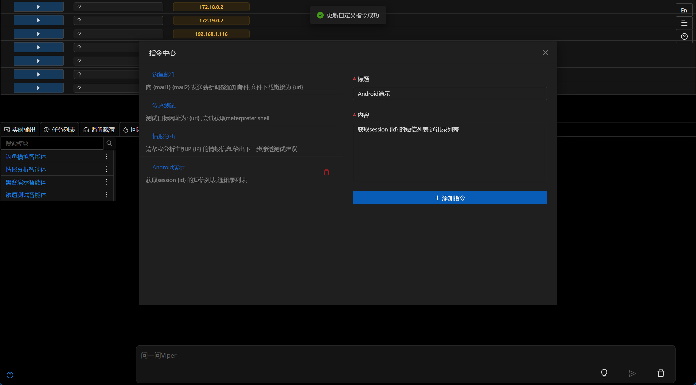

# 3.1.7 - 有 Python 就够了

## 多个 Kit 套件模块

- 新增`部署Kit套件到Windows主机`模块,详细信息参考[部署Kit套件到Windows主机](../module/Execution_CommandAndScriptingInterpreter_DeployKitWindows.md)
- 更新`部署Kit套件到Linux主机`模块,详细信息参考[部署Kit套件到Linux主机](../module/Execution_CommandAndScriptingInterpreter_DeployKit.md)
- 新增`Windows主机信息收集 (Kit)`模块,详细信息参考[Windows主机信息收集 (Kit)](../module/Discovery_Multi_LocalWindowsInfoCollect.md)
- 新增`内网端口扫描 (Kit)`模块,详细信息参考[内网端口扫描 (Kit)](../module/Discovery_NetworkServiceScanning_PortScanByPythonKit.md)
- 新增`内网端口扫描与服务识别 (Kit)`模块,详细信息参考[内网端口扫描与服务识别 (Kit)](../module/Discovery_NetworkServiceScanning_PortScanWithServiceByPythonKit.md)
- 新增`执行Python脚本 (Kit)`模块,详细信息参考[执行Python脚本 (Kit)](../module/Execution_CommandAndScriptingInterpreter_RunPythonScriptByKit.md)

## 情报分析智能体

- 更新智能体提示词
- `部署Kit套件到Windows主机`收集到的情报信息可以使用智能体进行分析,并给出下一步行动计划

## 钓鱼模拟智能体

- 更新智能体提示词,更符合实战中针对固定公司员工的钓鱼模拟
- 当前支持一次性给多个邮箱发送邮件

## 智能体-指令中心

- 新增`指令中心`功能,用户可以快捷输入预设指令(提示词)或自定义指令(提示词),并发送给智能体执行

## 优化

- UI/UX优化
- 更新metasploit-framework至最新版本(6.4.70)

## Bug修复

- 修复`Session监控`不发送通知问题 [issues 249](https://github.com/FunnyWolf/Viper/issues/249)

## 开发者笔记

新版本的一个大的更新是支持Windows部署Kit套件,也就是支持在Windows主机中使用python.实现方式是将准备好的Python解释器使用7zip打包成Kit套件,然后在Windows主机中解压即可使用.

相比于之前内存执行Python脚本的方式,这种方式可以使用更多的Python库,比如requests,wmi等,后期还可以添加更多的Python库.而且有很高的稳定性,运行脚本不会对Session造成影响.

如果Python脚本不涉及Shellcode等敏感信息,即使脚本落地也基本不会触发杀软.

当前Viper版本已经支持Windows和Linux的Python环境部署,所以将已有的端口扫描脚本进行了优化,并添加了相关模块,使其可以使用Kit套件中的Python环境.

`Windows主机信息收集 (Kit)`是一个纯python实现的本机信息收集模块,可以一次性收集到Windows主机的基本信息,包括系统信息、进程列表、网络连接、桌面文件列表、安装软件列表等.收集到的信息可以使用智能体进行分析,并给出下一步行动计划.

另外添加了`执行Python脚本 (Kit)`模块,方便用户使用Kit套件中的Python环境执行自定义脚本.

`情报分析智能体`主要是针对`Windows主机信息收集 (Kit)`收集到的信息进行了提示词适配工作,提示词加入了更有针对性的指示,使得智能体可以更好地分析情报信息,并给出下一步行动计划.

`钓鱼模拟智能体`为了更加贴近实战,在提示词中加入了公司的相关提示,邮件发送API也加入一次性发送多个邮箱的功能,避免智能体多次调用Tools.

`指令中心`功能是一个新的功能,用户可以快捷输入预设指令(提示词)或自定义指令(提示词),并发送给智能体执行.这个功能可以提高用户的工作效率,减少重复的操作.

最后是常规的UI/UX优化和Bug修复,以及更新metasploit-framework至最新版本.
