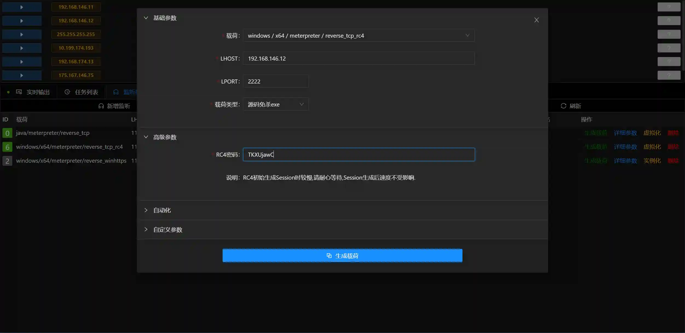

# Behinder与Viper联动

> 测试基于[**Behinder_v3.0 Beta 7**](https://github.com/rebeyond/Behinder/releases/tag/Behinder_v3.0_Beta_7)版本

## 目标主机不出网&上线java版本的meterpreter

> 116.85.xx.xx 是Viper的vps地址

+ Behinder已经正常获取到目标的webshell,可以正常执行命令
+ 在Viper中建立对应监听

+ Behinder中切换到 `反弹shell`按照如下配置

+ 执行后即可获取java版本的meterpreter

> 上线的原理
> 
> Behinder会在目标主机9090端口建立监听,通过Behinder客户端网络(也就是你的PC),将该端口映射到116.85.xx.xx的9090

## 目标主机不出网&上线原生版本的meterpreter

> java版本的meterpreter缺失了很多功能,原生版本的meterpreter更加强大

+ Behinder已经正常获取到目标的webshell,可以正常执行命令
+ Behinder中切换到 `内网穿透`按照如下配置

+ Viper按照如下配置建立监听

+ Viper按照如下配置生成载荷,请仔细阅读下方说明

> LHOST 填写为已控主机的内网IP地址,或者填写127.0.0.1
>
> LPORT 与Viper监听,Behinder配置一致
>
> RC4密码一定要与监听配置一致
>

+ 将生成的载荷(exe)通过Beninder上传并执行即可

> 上线的原理
>
> Behinder会在目标主机2222端口建立监听,通过Behinder客户端网络(也就是你的PC),将该端口映射到116.85.xx.xx的2222
>
> Viper生成载荷连接目标主机本地的2222端口就等同于连接VPS116.85.xx.xx的2222端口
