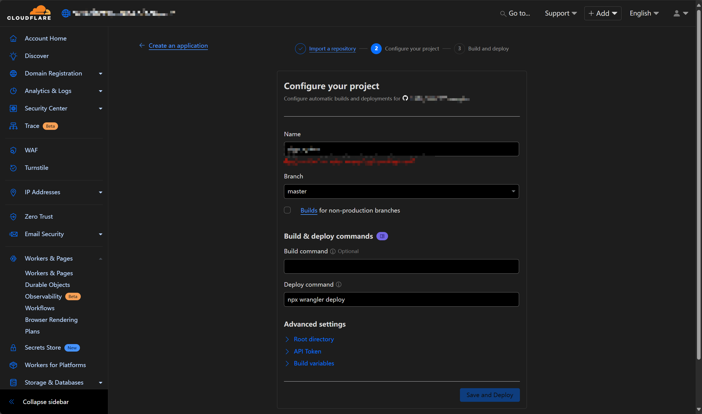

# 十分钟零成本创建Telegram Bot

> 本文将介绍如何快速创建一个Telegram Bot,并使用Cloudflare Worker实现后端服务,整个过程完全免费且仅需10分钟。


## 为什么我需要Telegram Bot

[Viper](https://www.viperrtp.com/)在早期版本就集成了Telegram Bot的功能,用于给用户发送系统通知.

在先前版本中用户配置该功能需要以下步骤:

- 用户向Telegram的BotFather发送/newbot创建bot
- 用户填写bot的name/username
- 用户获取bot的token (一个超长的字符串)
- 用户访问新创建的bot,发送/start启动一个新的对话
- 用户在[Viper](https://www.viperrtp.com/)中填写token,点击更新按钮获取chat_id列表
- 用户在[Viper](https://www.viperrtp.com/)中选择一个chat_id,点击更新按钮
- [Viper](https://www.viperrtp.com/)通过token和chat_id发送测试消息,配置完成

整个过程怎么说呢,就向你去饭店吃饭,需要你先自己种菜一样,太麻烦了.

新版本配置Telegram Bot的过程如下:

+ 打开Telegram搜索viperrtp,发送/start启动一个新的对话
+ 输入/chat_id获取chat_id (10位数字)
+ 在配置页面中输入刚获取的chat_id,[Viper](https://www.viperrtp.com/)会自动发送一条测试消息

整个过程非常丝滑.使用过程中我发现Telegram Bot有以下几个优势:

- 用户只需要和bot对话或发送指令即可访问你提供的服务,这样你无需构建前端界面,用户也不需要安装应用或访问网站
- bot与后台服务使用webhook进行交互,开发bot后台服务与开发restapi的webserver没有区别
- telegram + cloudflare worker 没有任何成本,完全免费

## 开始创建

开始之前你需要准备三个账号:

- telegram 账号 (这个不用说了)
- github 账号 (用于管理后台代码)
- cloudflare 账号 (用于部署Bot后台服务)

### Telegram创建Bot

telegram创建的bot可以理解为Bot的UI界面,用于通过和Bot对话来进行交互,所有界面部分都可以在BotFather中配置.

- Telegram的BotFather发送/newbot创建bot
- 输入bot的name/username
- 获取bot的token (一个超长的字符串)
- 注册一个命令(如chat_id)


### 创建Bot后台代码

推荐使用Cursor大法,以下是我prompt

```
你需要帮助我创建一个cloudflare worker 项目和所有代码,这个项目是一个叫YYYbot的telegram bot的后台服务,cloudflare中的域名是https://xxx.YYY.workers.dev
bot有如下功能
1. 用户发送/chat_id,则返回当前聊天的chat_id
2. 外部代码可以通过https://xxx.YYY.workers.dev/send_message,使用post向指定的chat_id发送消息
```

生成的项目不用修改,直接上传github就可以使用.

当然也可以使用我已经创建的项目[free_telegram_bot](https://github.com/FunnyWolf/free_telegram_bot)

### 部署后台 (cloudflare worker)

- 打开cloudflare worker页面,点击 create
- Import a repository选中新建的代码仓库后点击部署



- 设置bot的webhook指向新建的worker

```shell
curl -F "url=https://XXX.YYY.workers.dev" https://api.telegram.org/bot<YOUR_BOT_TOKEN>/setWebhook
```

- 大功告成,此时你可以向你的bot发送chat_id进行测试

## 后期拓展

如果你的目标用户和telegram用户重叠(比如[Viper](https://www.viperrtp.com/)就是),telegram bot和cloudflare worker组合基本可以满足绝大部分需求.

cloudflare作为互联网著名的**赛博佛祖**,worker每天有100W免费访问请求,对于交互类请求根本用不完.如果有数据库的需求还可以使用cloudflare D1或者supabase.

