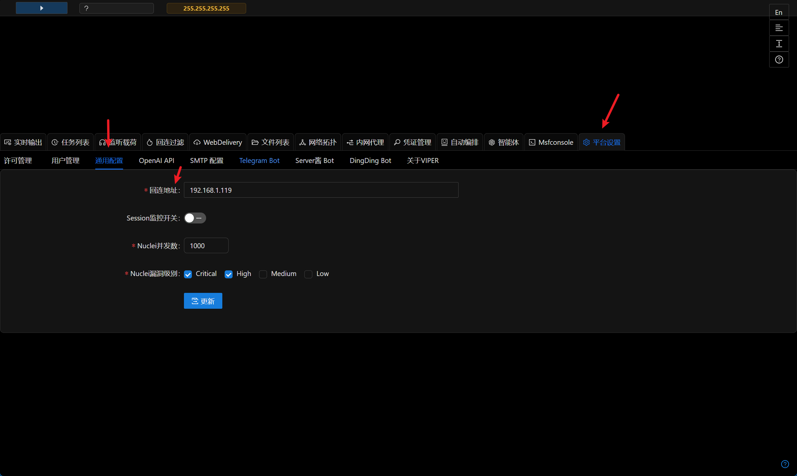
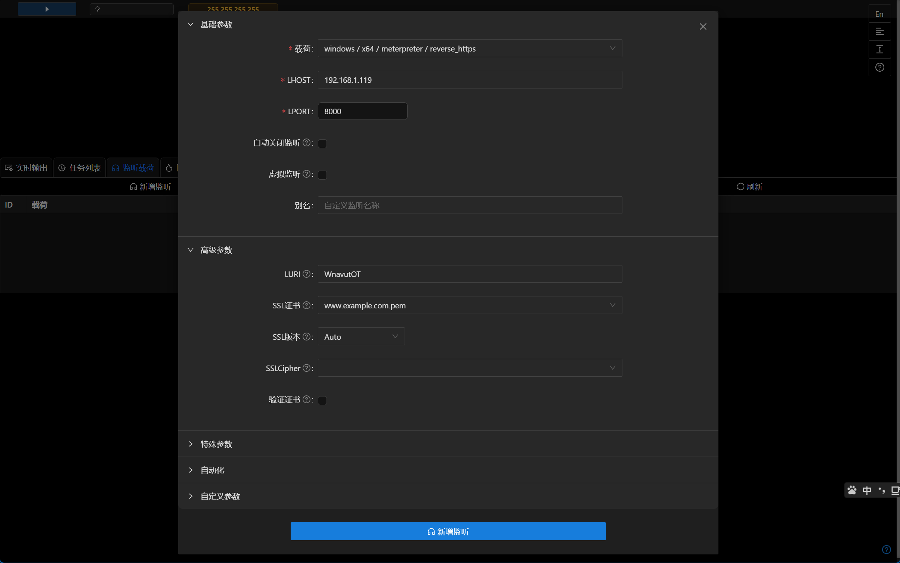
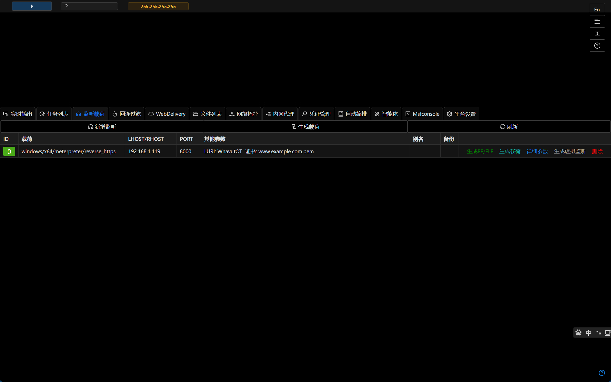
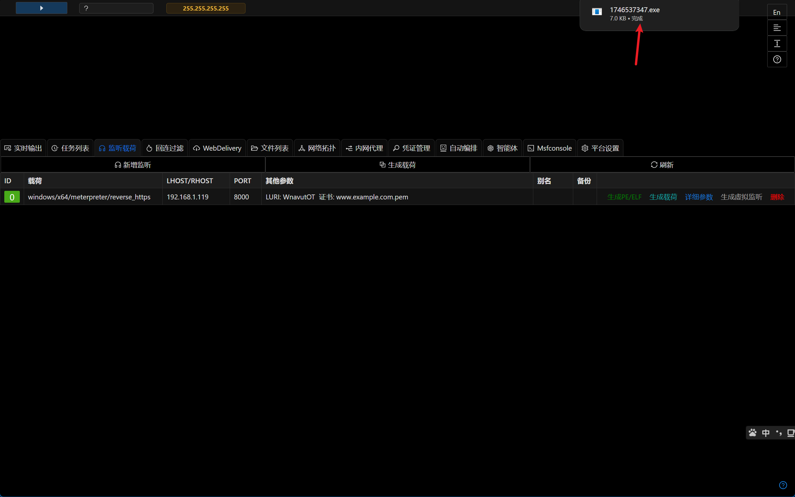
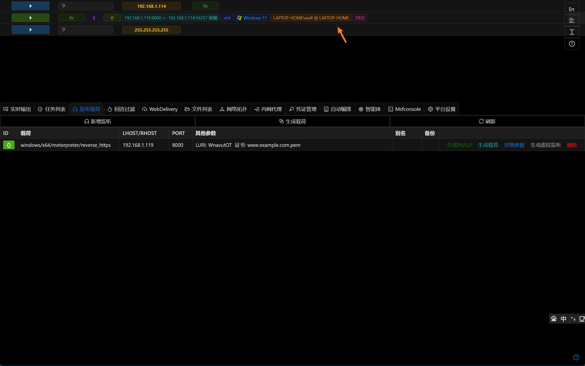
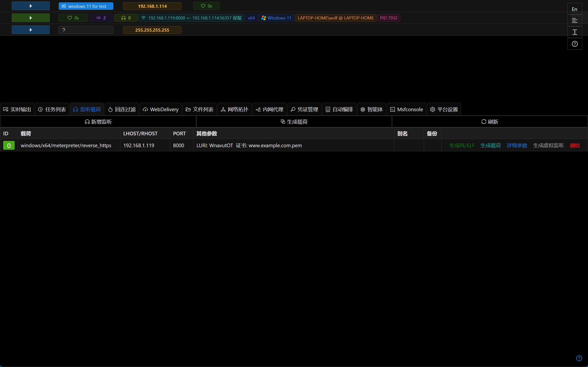

# 第一滴血

对手模拟和红队行动也通常称为后渗透或内网渗透,所测试的目标也通常是企业内部网络.

本篇文章介绍如何通过Viper获取第一个权限(Session).

## 回连地址

+ `平台设置` -> `通用配置` -> `回连地址` ,填写VPS的互联网IP地址或虚拟机IP

> 回连地址用于监听/载荷/端口转发等自动填写LHOST
> 与Webshell或者RDP等方式不同,当前C2通常使用反向连接,即植入物->C2,既能保证C2的集中控制,也能适配现代企业网络的NAT模式

## 新增监听

+ `监听载荷` -> `新增监听`

> 图中为windows的reverse_https类型的监听,LHOST会自动填写为回连地址,点击新增后会在8000端口启动监听(确保8000端口未被占用)
>
>后续章节会更详细的介绍各个payload的优缺点和使用场景

## 生成载荷

+ 点击监听的 `生成PE/ELF`,浏览器会自动下载一个exe或elf,具体取决于监听的类型(windows或linux)

## 第一滴血

+ 将生成的exe上传到目标主机中,然后执行
+ 控制台即获取了第一个Session

## Session

+ 控制台中的Session通过不同图标展示Session的配置信息,从左到右依次为`运行模块` `心跳` `Session ID` `监听 ID` `网络连接` `Arch` `OS版本` `主机名/当前用户` `PID` `通信通道`
  

+ 点击`运行模块`按钮会显示所有可用的模块

> 平台会根据当前目标是否有 session 权限来自动过滤适用的模块

+ `心跳`标签表示 session 最后的心跳时间

> 心跳时间超过 1 分钟后图标会变成红色,此时 VIPER 后台认为该 session 很可能已经失效
> 对于tcp类型的 payload,在长时间不操作时可能处于休眠状态导致心跳超过 1 分钟,对 session 重新操作即可唤醒 session

+ `Session ID`用于标注 session,是Session的唯一标识.

+ `监听 ID`展示Session使用的监听ID

+ `网络连接`表示 session 的源IP端口及目的IP端口,

> 此 ip 地址一般为企业出口路由器的公网 IP
> 此时鼠标移动到该标签上方会显示 session 完整网络连接信息及 GeoIP(地理位置信息)

+ `Arch`标签表示 session 的 arch,x64 及 x86 颜色不同

> arch 表示 session 进程的 arch,并不表示操作系统的 arch,操作系统的 arch 可以在主机信息里面查看

+ `OS版本`标识 session 是 windows 系统还是 linux 系统及系统版本
+ 长方形标签展示主机名,当前用户等信息.

> 其中白色的表示该 session 是普通用户权限,金色表示 session 是管理员权限(已过 uac),便于直观判断
>

+ 黄色的 IP 地址表示主机在内网中的 IP

> 内网可以理解为在 NAT 后面的网络
>
  
+ 正方形图标表示主机的图标标签,可以通过点击图标自行修改,鼠标移动到图标上时会显示主机的备注信息

+ 点击权限中的任意标签会弹出针对对权限的所有可用操作

+ 点击主机中的任意标签中可以操作/查看/修改/更新以主机 IP 为 ID 的信息集

## 常见问题

+ 为什么 VIPER 部署在阿里云 VPS 上没有正确生成 Session?

> 阿里云等国内云厂商有流量监控设备,请使用带加密的监听(reverse_https),由于 vps 带宽原因,执行 payload 后请稍等一段时间,请勿删除对应监听
>

+ 为什么我看到的界面和文档中的界面不一样/页面错乱?

> 最低分辨率支持 1366x768,如果界面错乱请尝试清空浏览器缓存.
