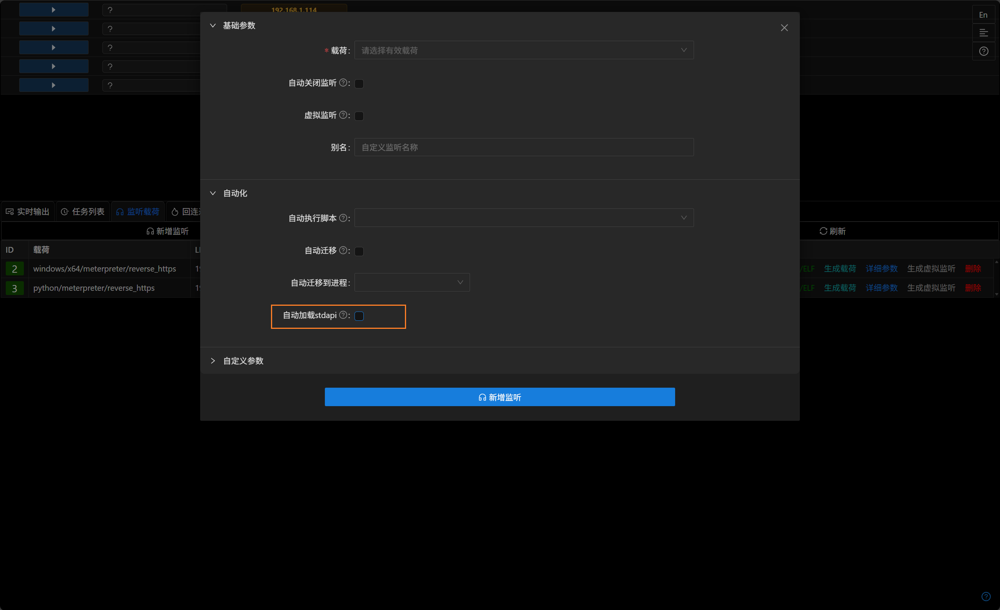
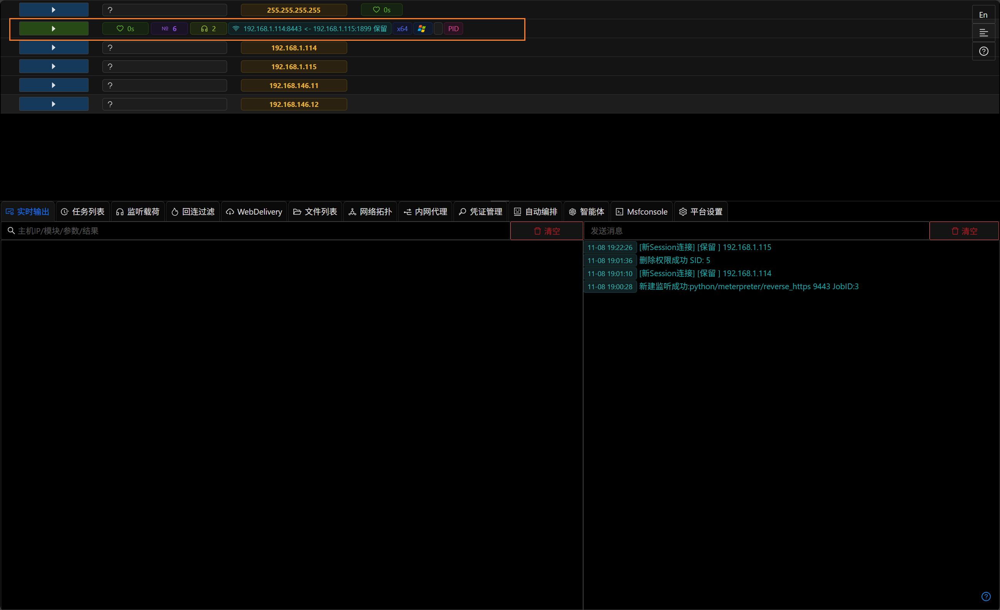

# 手动加载 stdapi 插件

## 简介

Viper在3.1.9版本中引入了手动加载 stdapi 插件的功能,整体stdapi插件被拆分为多个子插件,用户可以根据需求选择性加载所需的功能模块,从而减小内存特征.

## 操作步骤

- 创建监听时 **取消** 自动加载 stdapi 插件

- 使用该监听创建载荷并上线,上线的 Meterpreter 会显示不完整

- 进入meterpreter控制台,使用 `load` 命令手动加载所需的 stdapi 子插件 (load stdapi_sys/stdapi_ls/stdapi_net 等等)

- 加载stdapi_sys后执行 `sysinfo` 命令,meterpreter已经正确显示