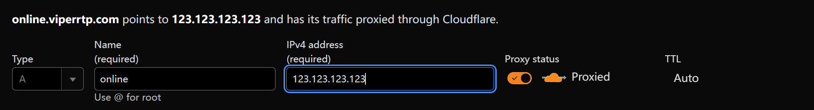
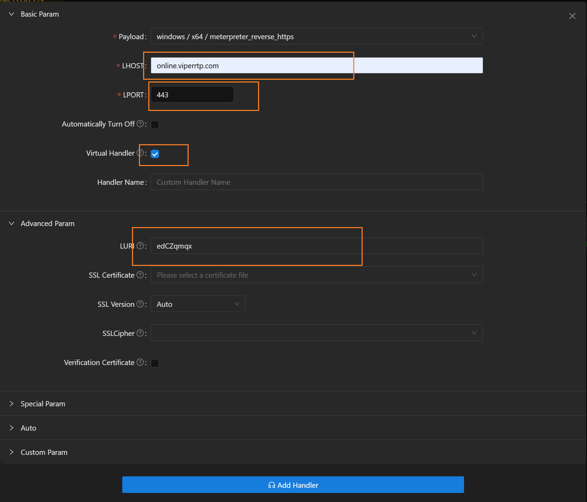

# 使用CDN上线meterpreter

## 准备工作

+ 购买域名 (推荐使用[cloudflare](https://www.cloudflare.com/))
+ [cloudflare](https://www.cloudflare.com/) 账号

## 配置CDN

+ 登录cloudflare,选择域名,点击`DNS`

+ 添加一条A记录,将域名解析到VPS的IP地址,并配置CDN加速

## 新建监听

+ 在Viper中新建监听,选择`meterpreter_reverse_http` (Windows/Linux都支持)

+ LHOST填写VPS的ip,LPORT填写80,记录LURI的值

## 生成载荷

+ 在Viper中新建监听,选择`meterpreter_reverse_https`

+ LHOST填写配置CDN的域名,LPORT填写443,LURI填写为上一步记录的LURI值

+ 选中`虚拟监听`,新建监听(这个监听只是用于生成载荷,不需要实际建立监听)

+ 点击`生成PE/ELF`生成载荷

+ 上传到目标主机执行

## 注意事项

+ 监听和载荷只支持`meterpreter_reverse_http(s)`类型
